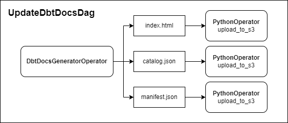

# Overview
`ea_airflow_util` contains additional Airflow functionality used within EDU that falls outside the scope of `edu_edfi_airflow`.


# Callables
Various Airflow callables have been defined in bespoke submodules under `ea_airflow_util.callables`.
These have been outlined below.

## airflow
Airflow utility helpers that are used for argument-passing and parameter-checking in DAGs

<details>
<summary>See more:</summary>

-----

When importing this submodule, be careful not to overwrite `airflow` in your namespace!
```python
# Do not do this!  This will overwrite `import airflow`.
from ea_airflow_util.callables import airflow

# Use one of these instead!
from ea_airflow_util.callables import airflow as airflow_util
from ea_airflow_util.callables.airflow import xcom_pull_template
```

### xcom_pull_template(task_ids, key)
Build an `xcom_pull` string for passing arguments between tasks.
Either a task-ID or task operator can be passed.
The default return key `return_value` is the final return value of the operator.

### skip_if_not_in_params_list(param_name, value)
Verify whether a value is defined in a passed parameter list, and raise an `AirflowSkipException` otherwise.
Raise an error if the parameter is not defined.

-----

</details>


## casing
String-casing callables (i.e., snake_casing or CamelCasing)

<details>
<summary>See more:</summary>

-----

### snake_case(string)
Convert a string to `string_case`.

### record_to_string_case(record)
Convert the keys of a JSON record into snake_case.
Raise an error if a name-collision occurs after formatting.

-----

</details>


## ftp
FTP- and SFTP-utility helpers

<details>
<summary>See more:</summary>

-----

### download_all(ftp_conn_id, remote_dir, local_dir, endswith)
Download all files from an FTP to disk, optionally filtering on file-extension endings.

-----

</details>


## gsheets
Google-sheets authentication and parsing helpers

<details>
<summary>See more:</summary>

-----

### get_google_client_from_airflow(gcp_conn_id, key_field)
Create a Google Sheets client populated with key data in an Airflow connection.
The key data can be saved in a separate, linked file, or as a JSON structure in the connection.
The Airflow connection key field can be specified; otherwise, both will be tried.

### get_google_spreadsheet_by_url(google_cloud_client, google_sheets_url)
Call the Google Sheets API and retrieve a Spreadsheet based on a given URL.
If API Rate Limit has been reached, use Truncated exponential backoff strategy to retry.

### parse_google_worksheet(worksheet)
Parse a gspread worksheet and retrieve the relevant data.

### get_worksheet_from_google_spreadsheet(spreadsheet, sheet_index, sheet_name)
Parse a Google spreadsheet and return a specific worksheet by index or name.
If neither is specified, retrieve the zeroth worksheet.

### get_and_serialize_google_survey_url_to_jsonl(gcp_conn_id, survey_url, output_dir)
Unified method for retrieving data from a Google survey and writing to disk as JSON lines.

-----

</details>


## jsonl
JSON utility helpers. Most Airflow tasks write data to disk and database as JSON lines.

<details>
<summary>See more:</summary>

-----

### serialize_json_records_to_disk(json_records, output_path, **kwargs)
Write an iterator of dictionaries to an output path as JSON lines.
Optional arguments customize the output.


### translate_csv_file_to_jsonl(local_path, output_path, **kwargs)
Transform a CSV file to JSON lines.
If output_path is not specified, rewrite the CSV file with a .jsonl file extension.
Optional arguments customize the output.

-----

</details>


## s3
Helpers for getting data to S3

Note: There are some SQL/Snowflake callables that interface with S3.

<details>
<summary>See more:</summary>

-----

### disk_to_s3(s3_conn_id, local_path, base_dir, bucket, delete_local, **kwargs)
Upload local files to S3.
Optional arguments apply schema-checking and path-mutation.

### list_s3_keys(s3_hook, s3_bucket, s3_key)
Internal utility function for listing S3 keys.
Note: this method uses a pre-instantiated S3 hook instead of a connection ID.

-----

</details>


## sharefile
Helpers when interfacing with Sharefile

<details>
<summary>See more:</summary>

-----

### list_sharefile_objects(sharefile_conn_id, remote_dir)
List object names in a specified Sharefile directory.

### sharefile_to_disk(sharefile_conn_id, sharefile_path, local_path, ds_nodash, ts_nodash, delete_remote=False, file_pattern=None, recursive=True)
Transfer all files from a ShareFile folder to a local date-stamped directory, optionally deleting the remote copy.

### disk_to_sharefile(sf_conn_id, sf_folder_path, local_path)
Post a file or the contents of a directory to the specified Sharefile folder

### s3_to_sharefile(s3_conn_id, s3_key, sf_conn_id, sf_folder_path):
Copy a single file from S3 to Sharefile

-----

</details>


## slack
This package contains several callback functions which can be used with Slack webhooks to alert at task failures or successes, or when SLAs are missed.
Each function takes the Slack Airflow connection ID as their primary argument.
The contents of the callback messages are filled automatically via the DAG run context.

<details>
<summary>See more:</summary>

-----

Airflow callbacks only accept expected arguments, not kwargs.
Because these custom Slack callback functions expect the additional argument `http_conn_id`, this argument must be filled before applying the callbacks to the DAG.
This can be done using the `functools.partial()` function, as follows:
```python
from functools import partial

on_failure_callback = partial(slack_alert_failure , http_conn_id=HTTP_CONN_ID)
on_success_callback = partial(slack_alert_success , http_conn_id=HTTP_CONN_ID)
sla_miss_callback   = partial(slack_alert_sla_miss, http_conn_id=HTTP_CONN_ID)
```

### slack_alert_failure()
>🔴 Task Failed.  
**Task**: {task_id}  
**Dag**: {dag_id}  
**Execution Time**: {logical_date}  
**Log Url**: {log_url}  

### slack_alert_success()
>✔ Task Succeeded.  
**Task**: {task_id}  
**Dag**: {dag_id}  
**Execution Time**: {logical_date}  
**Log Url**: {log_url}  

### slack_alert_sla_miss()
>🆘 **SLA has been missed.**  
**Task**: {task_id}  
**Dag**: {dag_id}  
**Execution Time**: {logical_date}

Note, due to different definitions of task-failure/success callbacks and SLA callbacks, `Log Url` is unavailable in SLA callback messages.
This will be investigated further and patched in a future update.

### slack_alert_download_failure(remote_path, local_path, error)
>🔴 File did not download  
**Remote Path**: {remote_path}  
**Local Path**: {local_path}  
**Task**: {task_id}  
**Dag**: {dag_id}  
**Execution Time**: {logical_date}  
**Log Url**: {log_url}  
**Error**: {error}

### slack_alert_s3_upload_failure(local_path, file_key, error)
>🔴 File did not upload to S3  
**File Path**: {local_path}  
**File Key**: {file_key}  
**Task**: {task_id}  
**Dag**: {dag_id}  
**Execution Time**: {logical_date}  
**Log Url**: {log_url}  
**Error**: {error}  

### slack_alert_insert_failure(file_key, table, error)
>🔴 File did not insert to database  
**File Key**: {file_key}  
**Dest Table**: {table}  
**Task**: {task_id}  
**Dag**: {dag_id}  
**Execution Time**: {logical_date}  
**Log Url**: {log_url}  
**Error**: {error}

### slack_alert_file_format_failure(local_path, file_type, cols_expected, cols_found)
>🔴 File did not match expected spec  
**File Path**: {local_path}  
**File Type**: {file_type}  
**Exp. Cols**: {cols_expected}  
**Found Cols**: {cols_found}  
**Task**: {task_id}  
**Dag**: {dag_id}  
**Execution Time**: {logical_date}  
**Log Url**: {log_url}

### slack_alert_match_spec_failure(local_path, error)
>🔴 File did not match file spec  
**File Path**: {local_path}  
**Task**: {task_id}  
**Dag**: {dag_id}  
**Execution Time**: {logical_date}  
**Log Url**: {log_url}  
**Error**: {error}

-----

</details>


## snowflake
Helpers for getting data out of and into Snowflake

<details>
<summary>See more:</summary>

-----

### snowflake_to_disk(snowflake_conn_id, query, local_path, **kwargs)
Copy data from Snowflake to local disk using a passed query.
Optional arguments alter formatting and chunking when writing to disk.

-----

</details>


## sql
Helpers for getting data out of and into different (non-Snowflake) SQL dialects

<details>
<summary>See more:</summary>

-----

### mssql_to_disk(conn_string, tables, local_path)
Copy data from MySQL to local disk.

### s3_to_postgres(pg_conn_id, s3_conn_id, dest_table, column_customization, options, s3_key, s3_region, **kwargs)
Copy data from an S3 filepath into Postgres.
Optional arguments alter table clean-up and import logic.

### s3_dir_to_postgres(pg_conn_id, s3_conn_id, dest_table, column_customization, options, s3_key, s3_region, **kwargs)
Copy all files from an S3 directory into Postgres.
Optional arguments alter table clean-up and import logic.

-----

</details>


## ssm
SSM ParameterStore helpers for extracting parameter strings from AWS.
This code is used exclusively in `AWSParamStoreToAirflowDAG`.


## variable
Utility methods for checking and updating Airflow variables

<details>
<summary>See more:</summary>

-----

### update_variable(var, value)
Update an Airflow variable with the specified value.
A callable can be passed in `value` to update the variable in-place.

### check_variable(var, condition, force)
Compare the current value of a variable against a passed boolean condition.
Raise an `AirflowSkipException` if the result is False.
Always succeed if `force is True`. 

-----

</details>


## zip
Compressed-file utility methods

<details>
<summary>See more:</summary>

-----

### extract_zips(local_dir, extract_dir, filter_lambda, remove_zips)
Extract zip files from a local_dir to an extract_dir, optionally filtering on filepath.

-----

</details>


# DAGs
All DAGs defined in this package utilize the `EACustomDAG` behind the scenes.
This means that unconventional DAG arguments like `slack_conn_id` can be passed to any DAG.

## EACustomDAG
This is a DAG factory that pre-instantiates default arguments and UDMs used across our projects.
By default, `max_active_runs` is set to 1, and catchup arguments are turned off.
Any non-standard DAG-kwargs are ignored.

If a Slack connection ID is passed through `slack_conn_id`, failure and SLA callbacks are automatically instantiated.
This argument can also be accessed in UDMs under the key `slack_conn_id`.


## AirflowDBCleanDAG
The Airflow database backend does not remove historic records by default.
This DAG removes data older than a specified number of retention days.
Note that the DAG errors when attempting to remove data newer than 30 days.

<details>
<summary>Arguments:</summary>

-----

 Argument       | Description                                                           |
|----------------|-----------------------------------------------------------------------|
| retention_days | number of days of log-data to preserve (default `90`)                 |
| dry_run        | whether to complete a dry-run instead of a real run (default `False`) |
| verbose        | whether to turn on verbose logging (default `False`)                  |

Additional `EACustomDAG` arguments (e.g. `slack_conn_id`) can be passed as kwargs.

-----

</details>


## RunDbtDag
`RunDbtDag` is an Airflow DAG that completes a full DBT run with optional post-run behavior.
Seed tables are fully refreshed, all models are run, and all tests are tested.
This emulates the behavior of a `dbt build` call, but with more control over parameters and failure states.

If all tests succeed, schemas are optionally swapped (e.g. from `rc` to `prod`).
Additionally, DBT artifacts are optionally uploaded using the [Brooklyn Data dbt_artifacts](https://github.com/brooklyn-data/dbt_artifacts) `upload_dbt_artifacts_v2` operation.

<details>
<summary>Arguments:</summary>

-----

| Argument                    | Description                                                                                            |
|-----------------------------|--------------------------------------------------------------------------------------------------------|
| environment                 | environment name for the DAG label                                                                     |
| dbt_repo_path               | path to the project `/dbt` folder                                                                      |
| dbt_target_name             | name of the DBT target to select                                                                       |
| dbt_bin_path                | path to the environment `/dbt` folder                                                                  |
| full_refresh                | boolean flag for whether to apply the `--full-refresh` flag to incremental models (default `False`)    |
| full_refresh_schedule       | Cron schedule for when to automatically kick off a full refresh run                                    |
| opt_swap                    | boolean flag for whether to swap target schema with `opt_dest_schema` after each run (default `False`) |
| opt_dest_schema             | optional destination schema to swap target schema with if `opt_swap=True`                              |
| opt_swap_target             | target used to rerun views if `opt_swap=True` (default `opt_dest_schema)                               |
| upload_artifacts            | boolean flag for whether to upload DBT artifacts at the end of the run (default `False`)               |
| dbt_incrementer_var         | optional Airflow variable to increment after successful `dbt run`                                       |
| trigger_dags_on_run_success | optional list of dags to be triggered by a successful dbt_run                                          |

Additional `EACustomDAG` arguments (e.g. `slack_conn_id`) can be passed as kwargs.

-----

</details>


## UpdateDbtDocsDag
`UpdateDbtDocsDag` is an Airflow DAG that generates the three [DBT docs](https://docs.getdbt.com/reference/commands/cmd-docs) metadata files and uploads them to a bucket on AWS S3.
If an AWS Cloudfront instance is pointed to this S3 bucket, a static website is built that is identical to the one generated by `dbt docs generate`.

<details>
<summary>Arguments:</summary>

-----

| Argument            | Description                                                                                       |
|---------------------|---------------------------------------------------------------------------------------------------|
| dbt_repo_path       | path to the project `/dbt` folder                                                                 |
| dbt_target_name     | name of the DBT target to select                                                                  |
| dbt_bin_path        | path to the environment `/dbt` folder                                                             |
| dbt_docs_s3_conn_id | S3 Airflow connection ID where S3 bucket to upload DBT documentations files is defined in `schema` |

Additional `EACustomDAG` arguments (e.g. `slack_conn_id`) can be passed as kwargs.

-----

</details>




## DbtSnapshotDag
DAG to run `dbt snapshot`

<details>
<summary>Arguments:</summary>

-----

| Argument            | Description                                                                                       |
|---------------------|---------------------------------------------------------------------------------------------------|
| dbt_repo_path       | path to the project `/dbt` folder                                                                 |
| dbt_target_name     | name of the DBT target to select                                                                  |
| dbt_bin_path        | path to the environment `/dbt` folder                                                             |

Additional `EACustomDAG` arguments (e.g. `slack_conn_id`) can be passed as kwargs.

-----

</details>


## S3ToSnowflakeDag
This DAG transfers data from an S3 bucket location into the Snowflake raw data lake.
It should be used when data sources are not available from an Ed-Fi ODS but need to be brought into the data warehouse.


<details>
<summary>Arguments:</summary>

-----

| Argument               | Description                                                                                      |
|------------------------|--------------------------------------------------------------------------------------------------|
| tenant_code            | ODS-tenant representation to be saved in Snowflake tables                                        |
| api_year               | ODS API-year to be saved in Snowflake tables                                                     |
| snowflake_conn_id      | Airflow connection with Snowflake credentials                                                    |
| database               | database in which tables are found                                                               |
| schema                 | schema in which tables are found                                                                 |
| data_source            | table data source to copy data into (`{data_source}__{resource_name}`)                           |
| resource_names         | array of table resource names to copy data into (`{data_source}__{resource_name}`)                   |
| transform_script       | additional transformations to complete on data before transfer to Snowflake                      |
| s3_source_conn_id      | Airflow connection with S3 source credentials                                                    |
| s3_dest_conn_id        | Airflow connection with S3 destination credentials                                               |
| s3_dest_file_extension | new file extension under which to save transformed data                                          |
| pool                   | Airflow pool to use for copying tasks                                                            |
| full_replace           | boolean flag for whether to delete all data from the table before copying over (default `False`) |
| do_delete_from_source  | boolean flag for whether to delete the data after copying over (default `True`)                  |

Additional `EACustomDAG` arguments (e.g. `slack_conn_id`) can be passed as kwargs.

-----

</details>

<details>
<summary>Example YAML configuration:</summary>

```yaml
s3_to_snowflake_dags__default_args: &s3_to_snowflake_dags__default_args
  default_args: *default_task_args
  schedule_interval: null
  start_date: '2022-08-01'
  database: raw
  schema: external
  s3_source_conn_id: 'external_s3'
  s3_dest_conn_id: 'data_lake'
  transform_script: '/home/airflow/airflow/dags/util/csv_to_json.py'
  slack_conn_id: null
  snowflake_conn_id: 'snowflake'
  pool: 'external_pulls'
  s3_dest_file_extension: '.json'
  full_replace: True

s3_to_snowflake_dags:
  canon_city_sd:
    ccr:
      2020:
        resource_names:
          - cdip_matriculation
          - concurrent_enrollment
        <<: *s3_to_snowflake_dags__default_args    
      2021:
        resource_names:
          - cdip_matriculation
          - concurrent_enrollment
        <<: *s3_to_snowflake_dags__default_args  
      2022:
        resource_names:
          - cdip_matriculation
          - concurrent_enrollment
        <<: *s3_to_snowflake_dags__default_args  
      2023:
        resource_names:
          - concurrent_enrollment
        <<: *s3_to_snowflake_dags__default_args        
```

</details>

<details>
<summary>Example DAG instantiation:</summary>

```python
import logging
from util import io_helpers
from ea_airflow_util import S3ToSnowflakeDag

logging.basicConfig(level=logging.INFO, format='%(levelname)s: %(message)s')

# Load variables from Airflow config
configs_dir = '/home/airflow/airflow/configs'
airflow_configs_file = 'airflow_config.yml'
airflow_configs = io_helpers.safe_load_yaml(configs_dir, airflow_configs_file)

if dag_params := airflow_configs.get('s3_to_snowflake_dags'):
    for tenant_code, data_sources in dag_params.items():
        
        for data_source, api_year_vars in data_sources.items():

            for api_year, dag_vars in api_year_vars.items():

                s3_to_snowflake_dag_id = f"s3_to_snowflake_{tenant_code}_{data_source}_{api_year}"

                s3_to_snowflake_dag = S3ToSnowflakeDag(
                        dag_id=s3_to_snowflake_dag_id,
                        tenant_code=tenant_code,
                        api_year=api_year,
                        data_source=data_source,
                        **dag_vars
                    )
                
                s3_to_snowflake_dag.build_s3_to_snowflake_dag()

                globals()[s3_to_snowflake_dag.dag.dag_id] = s3_to_snowflake_dag.dag
```

</details>


## SFTPToSnowflakeDag
This DAG transfers data from an SFTP source into the Snowflake raw data lake.
It should be used when data sources are not available from an Ed-Fi ODS but need to be brought into the data warehouse.

<details>
<summary>Arguments:</summary>

-----

| Argument               | Description                                                                                   |
|------------------------|-----------------------------------------------------------------------------------------------|
| s3_conn_id             | Airflow connection with S3 credentials                                                        |
| snowflake_conn_id      | Airflow connection with Snowflake credentials                                                 |
| database               | database in which tables are found                                                            |
| schema                 | schema in which tables are found                                                              |
| pool                   | Airflow pool to use for copying tasks                                                         |
| do_delete_from_local   | boolean flag for whether to delete the data from the SFTP after copying over (default `True`) |

Additional `EACustomDAG` arguments (e.g. `slack_conn_id`) can be passed as kwargs.

-----

</details>

<details>
<summary>Example YAML configuration:</summary>

```yaml
sftp_to_snowflake_dags__default_args: &sftp_to_snowflake_dags__default_args
  default_args: *default_task_args
  schedule_interval: '0 7 * * *'
  database: raw
  schema: external
  s3_conn_id: 'data_lake'
  full_replace: True
  slack_conn_id: null
  snowflake_conn_id: 'snowflake'
  pool: 'external_pulls'
  domain: 'ccr'
  sftp_conn_id: 'xello'
  sftp_filepath: '/GluonaCO/'
  local_base_path: '/efs/tmp_storage/'
  transform_script: '/home/airflow/airflow/dags/util/csv_to_json.py'
  do_delete_from_local: True

sftp_to_snowflake_dags:
  brush_sd:
    2025:
      xello_career_interests:
        file_pattern: '*StudentDataForBrush*'
        <<: *sftp_to_snowflake_dags__default_args
  haxtun_sd:
    2025:
      xello_career_interests:
        file_pattern: '*StudentDataForHax*'
        <<: *sftp_to_snowflake_dags__default_args
  lone_star_sd:
    2025:
      xello_career_interests:
        file_pattern: '*StudentDataForLone*'        
        <<: *sftp_to_snowflake_dags__default_args
  wiggins_sd:
    2025:
      xello_career_interests:
        file_pattern: '*StudentDataForWiggins*'
        <<: *sftp_to_snowflake_dags__default_args      
```

</details>

<details>
<summary>Example DAG instantiation:</summary>

```python
import logging
from util import io_helpers
from ea_airflow_util.dags.sftp_to_snowflake_dag import SFTPToSnowflakeDag

logging.basicConfig(level=logging.INFO, format='%(levelname)s: %(message)s')

# Load variables from Airflow config
configs_dir = '/home/airflow/airflow/configs'
airflow_configs_file = 'airflow_config.yml'
airflow_configs = io_helpers.safe_load_yaml(configs_dir, airflow_configs_file)
default_args = airflow_configs.get('sftp_to_snowflake_dags__default_args')
dag_params = airflow_configs.get('sftp_to_snowflake_dags')

sftp_to_snowflake_dag = SFTPToSnowflakeDag(
    dag_id='sftp_to_snowflake',
    **default_args
)

for tenant_code, api_year_vars in dag_params.items():

    for api_year, resource_name_vars in api_year_vars.items():

        for resource_name, dag_vars in resource_name_vars.items():

            tenant_year_resource_taskgroup = sftp_to_snowflake_dag.build_tenant_year_resource_taskgroup(
                tenant_code=tenant_code,
                api_year=api_year,
                resource_name=resource_name,
                **dag_vars
            )  

            tenant_year_resource_taskgroup

globals()[sftp_to_snowflake_dag.dag.dag_id] = sftp_to_snowflake_dag.dag
```

</details>


## AWSParamStoreToAirflowDAG
The Cloud Engineering and Integration team saves Ed-Fi ODS credentials as parameters in AWS Systems Manager Parameter Store.
Each Stadium implementation has a shared SSM-prefix, which is further delineated by tenant-code and/or API year.
There are three parameters associated with each ODS-connection:
```text
{SSM_PREFIX}/{TENANT_CODE}/key
{SSM_PREFIX}/{TENANT_CODE}/secret
{SSM_PREFIX}/{TENANT_CODE}/url
```

<details>
<summary>Arguments:</summary>

-----

| Argument            | Description                                                                                                     |
|---------------------|-----------------------------------------------------------------------------------------------------------------|
| region_name         | AWS region where parameters are stored                                                                          |
| connection_mapping  | Optional one-to-one mapping between Parameter Store prefixes and ODS credentials                                |
| prefix_year_mapping | Optional mapping between a shared SSM-prefix and a given Ed-Fi year for dynamic connections                     |
| tenant_mapping      | Optional mapping between tenant-code name in Parameter Store and its identity in Stadium in dynamic connections |
| join_numbers        | Optional boolean flag to strip underscores between district and number in dynamic connections (default `True`)  |

Additional `EACustomDAG` arguments (e.g. `slack_conn_id`) can be passed as kwargs.

-----

There are three types of mappings that can be defined in the Parameter Store DAG.
Arguments `connection_mapping` and `prefix_year_mapping` are mutually-exclusive.
Argument `tenant_mapping` is optional, and is only applied if `prefix_year_mapping` is defined.

In Stadium implementations with fewer tenants, it is suggested to manually map the `{SSM_PREFIX}/{TENANT_CODE}` strings to their Ed-Fi connection name in Airflow using `connection_mapping`.
For example:
```python
connection_mapping = {
    '/startingblocks/api/2122/sc-state': 'edfi_scde_2022',
    '/startingblocks/api/2223/sc-state': 'edfi_scde_2023',
    '/startingblocks/api/sc/state-2324': 'edfi_scde_2024',
}
```

In Stadium implementations with many tenants, an explicit one-to-one mapping between prefixes and connections may be untenable.
In cases like these, the `prefix_year_mapping` argument maps shared SSM-prefixes to API years and dynamically builds Airflow credentials.
For example:
```python
prefix_year_mapping = {
    '/startingblocks/api/districts-2122': 2022,
    '/startingblocks/api/sc/districts-2223': 2023,
}
```

Connection pieces between the prefixes and `url`, `key`, and `secret` are assumed to be tenant-codes, and connections are built dynamically.
Some standardization is always applied to inferred tenant-codes: spaces and dashes are converted to underscores.

However, in the case that the dynamically-inferred tenant-code does not match its identity in Stadium, the `tenant_mapping` can be used to force a match.
For example:
```python
tenant_mapping = {
    'fortmill': 'fort_mill',
    'york-4'  : 'fort_mill',
}
```

Using the example `prefix_year_mapping` and `tenant_mapping` defined above on the following Parameter Store keys will create a single Airflow connection: `edfi_fort_mill_2023`.
```text
/startingblocks/api/sc/districts-2223/fortmill/url
/startingblocks/api/sc/districts-2223/fortmill/key
/startingblocks/api/sc/districts-2223/fortmill/secret
```

Finally, there is an optional boolean argument `join_numbers` that is turned on by default.
When true, dynamically-inferred tenant-codes are standardized further to remove underscores between district name and code.
For example, `york_1` becomes `york1`.

When tenant-identification is not the penultimate element of the path, use the string `{tenant_code}` to automatically infer it for the mapping.
For example, `/ed-fi/apiClients/districts-2425-ds5/{tenant_code}/prod/Stadium` will find parameters that match the path shape, but will label paths based on the inferred `tenant_code`.

</details>


# Providers
Finally, this package contains a handful of custom DBT operators to be used as an alternative to PythonOperators.

## LoopS3FileTransformOperator
This operator extends Airflow's built-in `S3FileTransformOperator` to iterate over multiple files.
In addition, the new `dest_s3_file_extension` argument provides greater transparency in output type.
See [parent documentation](https://airflow.apache.org/docs/apache-airflow/1.10.13/_api/airflow/operators/s3_file_transform_operator/index.html) for more information.

<details>
<summary>Arguments:</summary>

-----

| Argument               | Description                                                                                   |
|------------------------|-----------------------------------------------------------------------------------------------|
| source_s3_keys         | array of S3 filepaths to transform                                                            |
| dest_s3_prefix         | destination S3 filepath in which to save transformed files (default: original filepath)       |
| dest_s3_file_extension | new file extension to give transformed files (default: original extension)                    |
| select_expression      | S3 select expression                                                                          |
| transform_script       | location of the executable transformation script                                              |
| script_args            | optional arguments to pass to the transformation script                                       |
| source_aws_conn_id     | source s3 connection                                                                          |
| source_verify          | whether to verify SSL certificates for S3 connection (default: SSL certificates are verified) |
| dest_aws_conn_id       | destination s3 connection                                                                     |
| dest_verify            | whether to verify SSL certificates for S3 connection (default: SSL certificates are verified) |
| replace                | replace destination S3 key if it already exists (default `True`)                              |

Additional Airflow operator args and kwargs can be passed during initialization.

-----

</details>


## DbtRunOperationOperator
This operator overrides `DbtBaseOperator` to allow us to pass the `--args` flag to `run-operation`.

This operation is the equivalent of `dbt run-operation {op_name} --args '{json.dumps(arguments)}'`

<details>
<summary>Arguments:</summary>

-----

| Argument  | Description                                   |
|-----------|-----------------------------------------------|
| op_name   | name of the DBT macro to run in the operation |
| arguments | argument dictionary to pass to the macro      |

Additional Airflow operator args and kwargs can be passed during initialization.

-----

</details>


## SFTPHook
This hook overrides `SSHHook` to interact with FTPs and SFTPs.
See [parent documentation](https://airflow.apache.org/docs/apache-airflow-providers-ssh/stable/_api/airflow/providers/ssh/hooks/ssh/index.html) for input arguments and usage.

## SharefileHook
This hook is built for interacting with ShareFile servers.

<details>
<summary>Arguments:</summary>

-----

| Argument          | Description                                            |
|-------------------|--------------------------------------------------------|
| sharefile_conn_id | name of the Airflow connection with ShareFile metadata |

Note that the connection in Airflow must be configured in an unusual way:
- Host should be the API endpoint
- Schema should be the authentication URL
- Login/Password are filled out as normal
- Extra should be a dictionary structured as follows:
    ```{"grant_type": "password", "client_id": client_id, "client_secret": client_secret}```

-----

Methods:
- get_conn()
- download(item_id, local_path)
- upload_file(folder_id, local_file)
- folder_id_from_path(folder_path)
- delete(item_id)
- get_path_id(path)
- item_info(id)
- find_files(folder_id)
- find_folders(folder_id)
- get_access_controls(item_id)
- get_user(user_id)
- get_children(item_id)
- file_to_memory(item_id)
- download_to_disk(item_id, local_path)

</details>


## SharefileToDiskOperator
This operator transfers all files from a ShareFile folder to a local date-stamped directory, optionally deleting the remote copy.

<details>
<summary>Arguments:</summary>

-----

| Argument          | Description                                                          |
|-------------------|----------------------------------------------------------------------|
| sharefile_conn_id | name of the Airflow connection with ShareFile metadata               |
| sharefile_path    | the root directory to transfer                                       |
| local_path        | local path to stream ShareFile files into                            |
| delete_remote     | boolean flag to delete original files on ShareFile (default `False`) |

Additional Airflow operator args and kwargs can be passed during initialization.

-----

</details>


