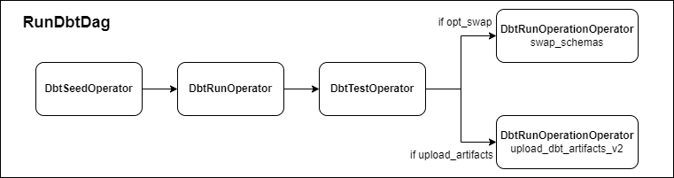

# Overview
`ea_airflow_util` contains additional Airflow functionality used within EDU that falls outside the scope of `edfi_airflow`


## RunDbtDag
`RunDbtDag` is an Airflow DAG that completes a full DBT run with optional post-run behavior.
Seed tables are fully refreshed, all models are run, and all tests are tested.
This emulates the behavior of a `dbt build` call, but with more control over parameters and failure states.

If all tests succeed, schemas are optionally swapped (e.g. from `rc` to `prod`).
Additionally, DBT artifacts are optionally uploaded using the [Brooklyn Data dbt_artifacts](https://github.com/brooklyn-data/dbt_artifacts) `upload_dbt_artifacts_v2` operation.

<details>
<summary>Arguments:</summary>

-----

| Argument              | Description                                                                                            |
|-----------------------|--------------------------------------------------------------------------------------------------------|
| environment           | environment name for the DAG label                                                                     |
| dbt_repo_path         | path to the project `/dbt` folder                                                                      |
| dbt_target_name       | name of the DBT target to select                                                                       |
| dbt_bin_path          | path to the environment `/dbt` folder                                                                  |
| full_refresh          | boolean flag for whether to apply the `--full-refresh` flag to incremental models (default `False`)    |
| full_refresh_schedule | Cron schedule for when to automatically kick off a full refresh run                                    |
| opt_dest_schema       | optional destination schema to swap target schema with if `opt_swap=True`                              |
| opt_swap              | boolean flag for whether to swap target schema with `opt_dest_schema` after each run (default `False`) |
| upload_artifacts      | boolean flag for whether to upload DBT artifacts at the end of the run (default `False`)               |
| slack_conn_id         | Slack webhook Airflow connection ID for sending run errors to a Slack channel                          |

Additional DAG arguments (e.g. `default_args`) can be passed as kwargs.

-----

</details>




## UpdateDbtDocsDag
`UpdateDbtDocsDag` is an Airflow DAG that generates the three [DBT docs](https://docs.getdbt.com/reference/commands/cmd-docs) metadata files and uploads them to a bucket on AWS S3.
If an AWS Cloudfront instance is pointed to this S3 bucket, a static website is built that is identical to the one generated by `dbt docs generate`.

<details>
<summary>Arguments:</summary>

-----

| Argument            | Description                                                                                       |
|---------------------|---------------------------------------------------------------------------------------------------|
| dbt_repo_path       | path to the project `/dbt` folder                                                                 |
| dbt_target_name     | name of the DBT target to select                                                                  |
| dbt_bin_path        | path to the environment `/dbt` folder                                                             |
| dbt_docs_s3_conn_id | S3 Airflow connection ID where S3 bucket to upload DBT documentations files is defined in `schema` |

Additional DAG arguments (e.g. `default_args`) can be passed as kwargs.

-----

</details>


## Slack Callbacks
This package also contains several callback functions which can be used with Slack webhooks to alert at task failures or successes, or when SLAs are missed.
Each function takes the Slack Airflow connection ID as their primary argument.
The contents of the callback messages are filled automatically via the DAG run context.

Airflow callbacks only accept expected arguments, not kwargs.
Because these custom Slack callback functions expect the additional argument `http_conn_id`, this argument must be filled before applying the callbacks to the DAG.
This can be done using the `functools.partial()` function, as follows:
```python
from functools import partial

on_failure_callback = partial(slack_alert_failure , http_conn_id=HTTP_CONN_ID)
on_success_callback = partial(slack_alert_success , http_conn_id=HTTP_CONN_ID)
sla_miss_callback   = partial(slack_alert_sla_miss, http_conn_id=HTTP_CONN_ID)
```

There are three Slack callbacks currently included in this package:

### slack_alert_failure
>🔴 Task Failed.  
**Task**: {task_id}  
**Dag**: {dag_id}  
**Execution Time**: {logical_date}  
**Log Url**: {log_url}  

### slack_alert_success
>✔ Task Succeeded.  
**Task**: {task_id}  
**Dag**: {dag_id}  
**Execution Time**: {logical_date}  
**Log Url**: {log_url}  

### slack_alert_sla_miss
>🆘 **SLA has been missed.**  
**Task**: {task_id}  
**Dag**: {dag_id}  
**Execution Time**: {logical_date}  

Note, due to different definitions of task-failure/success callbacks and SLA callbacks, `Log Url` is unavailable in SLA callback messages.
This will be investigated further and patched in a future update.
